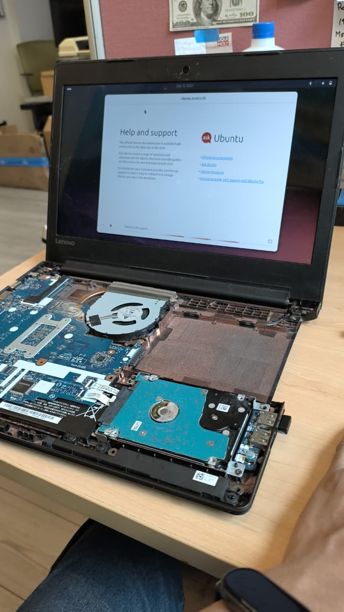
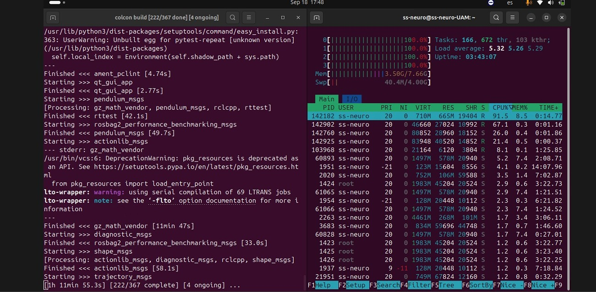
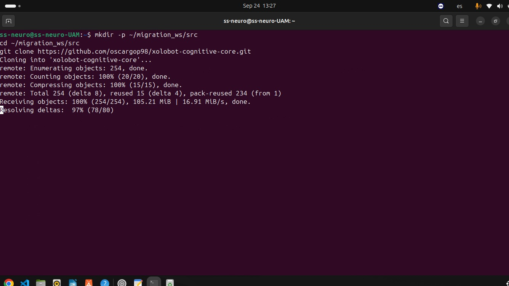
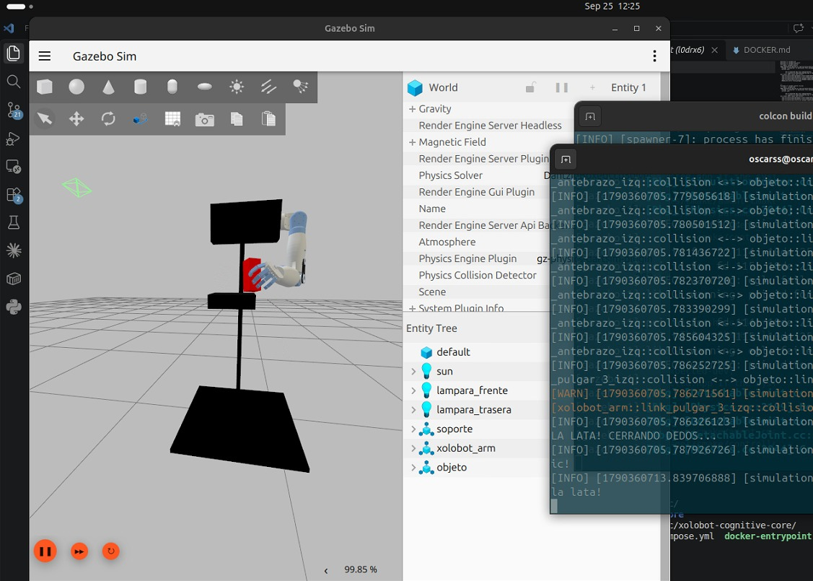

# Trimestre 26-P — Segundo Reporte de Servicio Social

**Programa:** Apoyo para implementar la Arquitectura Cognitiva Inspirada en Neuronas Espejo
**Alumno:** Oscar David González Pintor — Matrícula: 2173071702
**Licenciatura:** Ingeniería en Computación — UAM Cuajimalpa
**Responsable del proyecto:** Dra. Alicia Montserrat Alvarado González (Núm. económico: 41051)
**Periodo reportado:** 1 de julio de 2026 — 30 de septiembre de 2026 (Meses 4, 5 y 6)

---

### Acreditación de la Segunda Mitad del Servicio Social (240 horas restantes)
Con las firmas que se presentan a continuación, se avala la entrega de este segundo informe trimestral y el cumplimiento satisfactorio de las 240 horas finales, cubriendo con ello el total de las 480 horas reglamentarias del proyecto.

<br><br><br>

\_\_\_\_\_\_\_\_\_\_\_\_\_\_\_\_\_\_\_\_\_\_\_\_\_\_\_\_\_\_\_\_\_\_\_\_\_\_\_\_\_  
**Oscar David González Pintor**  
Prestador de Servicio Social  

<br><br><br>

\_\_\_\_\_\_\_\_\_\_\_\_\_\_\_\_\_\_\_\_\_\_\_\_\_\_\_\_\_\_\_\_\_\_\_\_\_\_\_\_\_  
**Dra. Alicia Montserrat Alvarado González**  
Responsable del Proyecto  

---

# Introducción

El presente reporte trimestral documenta las actividades realizadas durante los meses cuatro, cinco y seis del servicio social, inscrito bajo el programa **Apoyo para implementar la Arquitectura Cognitiva Inspirada en Neuronas Espejo**. Durante este periodo, el trabajo se desplazó de la implementación inicial de los módulos cognitivos —completada en el trimestre anterior— hacia su **validación, consolidación y transferencia**.

El sustrato técnico sobre el que opera la arquitectura fue sometido a pruebas de reproducibilidad en hardware independiente, se reorganizó el repositorio oficial del proyecto para facilitar su continuidad por nuevos integrantes del laboratorio, y se ejecutó el traspaso formal del entorno a un alumno de incorporación reciente. Paralelamente, se resolvieron los problemas de infraestructura que quedaban pendientes del trimestre anterior y se gestionó la estabilidad del ambiente de desarrollo ante restricciones de almacenamiento críticas.

## Antecedentes

El primer reporte trimestral (Meses 1–3, abril–junio 2026) estableció la infraestructura computacional sobre la que opera la arquitectura cognitiva. Los logros de ese periodo fueron:

- Migración del entorno de simulación de ROS 2 Iron/Gazebo Clásico a **ROS 2 Jazzy Jalisco con Gazebo Harmonic**, encapsulado en una imagen Docker de 5 capas reproducible.
- Implementación de la **Corteza Premotora** (`SimulationController.cpp`) como nodo C++ capaz de planificar trayectorias reactivas y detectar contacto a través de 7 bumpers.
- Configuración de la **Corteza Motora Primaria** (JTC de `ros2_control`) y de las **Cortezas Somatosensorial y Parietal** (bridge YAML con Gazebo Harmonic).
- Resolución de los cuatro problemas de infraestructura en VM: forwarding gráfico X11, sincronización DDS, aislamiento IPC y colisión cinemática con waypoint.
- Validación de la secuencia completa de agarre autónomo: aproximación → contacto → cierre de dedos → elevación.

El presente trimestre parte de ese estado funcional y se enfoca en su robustez, portabilidad y continuidad.

---

# Objetivo

Consolidar y transferir la Arquitectura Cognitiva Inspirada en Neuronas Espejo para el robot Xolobot, mediante:

1. La validación de la reproducibilidad del entorno en hardware independiente, mediante pruebas de estrés en una instalación limpia de Ubuntu 24.04.
2. La reorganización del repositorio oficial del proyecto en un repositorio dedicado (`xolobot-cognitive-core`), con documentación maestra que garantice la incorporación autónoma de nuevos integrantes.
3. La gestión de la infraestructura de desarrollo: resolución de conflictos de dependencias, optimización del almacenamiento en disco y expansión de la capacidad de almacenamiento disponible.
4. El traspaso formal del entorno al alumno Diego Vázquez, en coordinación con la Dra. Montserrat.

---

# Planeación

## Calendario Oficial del Proyecto

La siguiente tabla reproduce las actividades oficiales del programa de servicio social tal como figuran en la carta de aceptación emitida el 31 de marzo de 2026. El reporte actual cubre los **Meses 4, 5 y 6**.

| Actividad | Mes 1 | Mes 2 | Mes 3 | Mes 4 | Mes 5 | Mes 6 |
|---|:---:|:---:|:---:|:---:|:---:|:---:|
| Apoyo en la implementación del nodo Corteza Premotora y enviar a la memoria procedural: robot simulado | ✦ | ✦ | | | | |
| Apoyo para levantar el brazo en ROS1 | | | | | | |
| Apoyo para migrar el robot de ROS1 a ROS2 | ✦ | ✦ | ✦ | ✦ | ✦ | ✦ |
| Apoyo para adaptar lo que ya se tiene de las cortezas Parietal, Somatosensorial, motora primaria al robot simulado | | ✦ | | | | |
| Apoyo para poner en el mismo espacio el brazo y el robot simulados | | | ✦ | ✦ | | |
| Apoyo en la documentación del proyecto | ✦ | ✦ | ✦ | ✦ | ✦ | ✦ |
| Informe trimestral | | | ✦ | | | ✦ |
| Informe final | | | | | | ✦ |

**Correspondencia semana–mes para este trimestre:**

| Mes | Semanas | Actividades ejecutadas |
|---|---|---|
| 4 (Julio) | 13–16 | Validación Docker en VM, reorganización del repositorio oficial, documentación maestra |
| 5 (Agosto) | 17–20 | Prueba Acid Test en `ss-neuro`, resolución de conflictos de dependencias, gestión de almacenamiento |
| 6 (Septiembre) | 21–24 | Expansión de almacenamiento NTFS, documentación de handover, onboarding de Diego Vázquez, informe final |

---

# Inicio

El trimestre comenzó con el entorno cognitivo funcionando sobre el equipo principal de desarrollo. El reto de esta fase no era ya implementar, sino **garantizar que lo implementado pudiera sobrevivir fuera de ese equipo**: en una máquina diferente, con un usuario nuevo, sin la memoria contextual del desarrollador original. Esta distinción —de implementación a reproducibilidad— define la naturaleza del trabajo documentado a continuación.

---

# Desarrollo

---

## Semanas 13–15

### Consolidación de la integración brain+sim — Docker en entorno de VM

Correspondiente a la actividad del Mes 4: *"Apoyo para poner en el mismo espacio el brazo y el robot simulados"* y *"Apoyo para migrar el robot de ROS1 a ROS2"*.

Las pruebas de VM del trimestre anterior habían dejado documentados cuatro problemas de infraestructura. En este bloque se consolidó su resolución y se validó que el entorno Docker completara el ciclo completo de arranque sin intervención manual.

#### Estado inicial: revisión de los cuatro problemas documentados

Los cuatro problemas resueltos en las Semanas 11–12 del trimestre anterior fueron verificados y confirmados como estables:

| Problema | Síntoma original | Solución aplicada | Estado |
|---|---|---|---|
| Colapso gráfico de Gazebo | `could not connect to display :0` | `~/.Xauthority` portable en compose | ✓ Estable |
| Bloqueo DDS en red de VM | `/clock` no visible desde `brain` | `ROS_LOCALHOST_ONLY=1` | ✓ Estable |
| Aislamiento IPC entre contenedores | JTC ignoraba trayectorias silenciosamente | `ipc: host` en ambos servicios | ✓ Estable |
| Colisión cinemática en aproximación | Antebrazo chocaba con pedestal | Waypoint alto intermedio | ✓ Estable |

#### Verificación del ciclo completo de arranque

Se ejecutó el flujo completo desde imagen limpia para confirmar que no existían dependencias ocultas del entorno del desarrollador:

```bash
# Construir imagen desde cero (sin cache)
docker compose build --no-cache

# Habilitar forwarding gráfico
xhost +local:docker

# Levantar simulador físico (Corteza Motora + Gazebo)
docker compose up sim

# En segunda terminal — lanzar nodo cognitivo (Corteza Premotora)
docker compose run brain
```

**Resultado:** La secuencia completa de agarre autónomo se ejecutó correctamente desde la imagen recién construida. Los cuatro problemas de VM no reaparecieron bajo las condiciones corregidas.

---

## Semanas 16–18

### Repositorio oficial — `xolobot-cognitive-core`

Correspondiente a la actividad continua de documentación: *"Apoyo en la documentación del proyecto"* y *"Apoyo para migrar el robot de ROS1 a ROS2"*.

El repositorio original del proyecto (`mi-brazo-robot-ros2-iron`) había sido creado durante la fase de migración y conservaba en su nombre, estructura y ramas el rastro de ese proceso. Para que el proyecto fuera accesible a nuevos integrantes sin requerir conocimiento del historial de migración, se tomó la decisión de crear un repositorio limpio y dedicado que representara el estado actual del sistema.

#### Creación del repositorio oficial

Se creó el repositorio `xolobot-cognitive-core` bajo la organización del alumno en GitHub y se estableció como repositorio principal del programa. El repositorio anterior fue marcado con `COLCON_IGNORE` y se eliminó su remote, preservándolo solo como referencia histórica local:

```bash
# Repositorio anterior — preservado solo localmente
cd ~/migration_ws/src/mi-brazo-robot-ros2-iron
touch COLCON_IGNORE
git remote remove origin

# Nuevo repositorio oficial
cd ~/migration_ws/src/xolobot-cognitive-core
git remote add origin https://github.com/oscargop98/xolobot-cognitive-core.git
git push -u origin main
```

#### Resolución del conflicto de versiones de `libfastcdr`

Durante el rebuild posterior a la reorganización se presentó un fallo de compilación originado por una actualización automática del sistema:

```
make[2]: *** No rule to make target
'/opt/ros/jazzy/lib/libfastcdr.so.2.2.7',
needed by 'install/lib/xolobot_arm_server/xolobot_arm_server'.
```

**Causa raíz:** `apt upgrade` actualizó `libfastcdr` de la versión `2.2.7` a `2.2.8`. El directorio `build/` contenía entradas de `CMakeCache.txt` con la ruta codificada a `libfastcdr.so.2.2.7`, que ya no existía en el sistema. Esto no es un error del código: el `CMakeCache` es un artefacto del proceso de compilación que se invalida cuando cambian las versiones de las librerías enlazadas dinámicamente.

**Solución:** Reconstrucción limpia eliminando los artefactos de build previos:

```bash
cd ~/migration_ws
rm -rf build/ install/ log/
colcon build
source install/setup.bash
```

**Aprendizaje documentado:** Después de ejecutar `apt upgrade` en cualquier equipo donde corre el proyecto, es necesario realizar un rebuild limpio. Esto aplica también a entornos del laboratorio que reciban actualizaciones automáticas.

#### README maestro y documentación de arquitectura

Se redactó el `README.md` maestro del repositorio con la estructura definitiva para nuevos integrantes. El documento cubre:

1. **Prerrequisitos del sistema** — advertencia explícita sobre el conflicto entre ROS 2 compilado desde fuente y el paquete `apt`, basada en un incidente real del proyecto.
2. **Instalación paso a paso** — desde `git clone` hasta `colcon build` y `source`.
3. **Panel de alias de control** — los ocho comandos del entorno de desarrollo con su función cognitiva correspondiente.
4. **Opción A (Nativa) y Opción B (Docker)** — instrucciones completas para ambas vías de ejecución.

Como complemento al README, se generó un documento técnico de apoyo para el traspaso del proyecto (`DEV_CONTEXT.md`), que consolida la arquitectura del sistema, el estado actual del código y las decisiones de diseño relevantes para quien continúe el desarrollo en fases posteriores. Este documento permite a nuevos integrantes familiarizarse con el contexto del proyecto sin depender de la disponibilidad del desarrollador original.

---

## Semanas 19–21

### Acid Test — Validación en hardware independiente (`ss-neuro`)

Correspondiente a la actividad del Mes 5: *"Apoyo para migrar el robot de ROS1 a ROS2"* — específicamente, validar que la migración produce un entorno reproducible sin la intervención del desarrollador original.

La pregunta que define este bloque es directa: **¿puede cualquier integrante del laboratorio, partiendo de una máquina limpia, llegar a tener el sistema corriendo siguiendo solo el README?** La prueba denominada "Acid Test" responde esta pregunta en condiciones reales.

#### Configuración del equipo de prueba

Se habilitó una laptop denominada `ss-neuro` como equipo de prueba independiente. Las condiciones de la prueba fueron deliberadamente restrictivas para reflejar el escenario de un nuevo integrante:

- Instalación limpia de **Ubuntu 24.04 LTS** (sin configuraciones previas del proyecto).
- Hardware con recursos moderados (CPU de generación anterior, RAM limitada).
- Sin historial de ROS 2 en el sistema.



#### Instalación de ROS 2 Jazzy Jalisco

Se siguió el procedimiento oficial de instalación vía `apt` tal como está documentado en el README:

```bash
# Configurar locales
sudo apt update && sudo apt install locales
sudo locale-gen en_US en_US.UTF-8
sudo update-locale LC_ALL=en_US.UTF-8 LANG=en_US.UTF-8

# Agregar repositorio de ROS 2
sudo apt install software-properties-common curl
sudo curl -sSL https://raw.githubusercontent.com/ros/rosdistro/master/ros.key \
    -o /usr/share/keyrings/ros-archive-keyring.gpg
echo "deb [arch=$(dpkg --print-architecture) signed-by=/usr/share/keyrings/ros-archive-keyring.gpg] \
    http://packages.ros.org/ros2/ubuntu $(. /etc/os-release && echo $UBUNTU_CODENAME) main" \
    | sudo tee /etc/apt/sources.list.d/ros2.list > /dev/null

# Instalar ROS 2 Jazzy completo
sudo apt update
sudo apt install ros-jazzy-desktop ros-jazzy-ros2-control \
    ros-jazzy-ros2-controllers ros-jazzy-gz-ros2-control \
    ros-jazzy-ros-gz-sim ros-jazzy-ros-gz-bridge \
    ros-jazzy-ros-gz-interfaces python3-colcon-common-extensions \
    python3-rosdep -y
```

#### Prueba de estrés — `colcon build` en hardware limitado

Una vez instalado ROS 2, se clonó el repositorio y se ejecutó la compilación completa. Dadas las limitaciones de hardware de `ss-neuro`, el proceso de compilación representó una prueba de estrés significativa:

```bash
mkdir -p ~/migration_ws/src
cd ~/migration_ws/src
git clone https://github.com/oscargop98/xolobot-cognitive-core.git
cd ~/migration_ws
source /opt/ros/jazzy/setup.bash
rosdep install --from-paths src --ignore-src -r -y
colcon build
```

La compilación tomó entre **2 y 3 horas**, manteniendo todos los núcleos de la CPU a su máxima capacidad de forma sostenida. Este comportamiento es esperado y no indica un error: el ecosistema ROS 2 Jazzy con Gazebo Harmonic requiere compilar cientos de unidades de traducción con dependencias encadenadas.



#### Validación final — Gazebo Harmonic en ejecución

Una vez completada la compilación, se ejecutó el sistema siguiendo exactamente los pasos del README:

```bash
source ~/migration_ws/install/setup.bash

# Inyectar aliases de control
bash ~/migration_ws/src/xolobot-cognitive-core/setup_aliases.sh
source ~/.bashrc

# Terminal 1 — Simulador
xolo_sim

# Terminal 2 — Nodo cognitivo
xolo_brain
```

**Resultado:** Gazebo Harmonic renderizó el brazo robótico Xolobot, el pedestal y la lata sin errores. El nodo `SimulationController` se sincronizó con el tiempo de simulación y completó la secuencia de agarre autónomo.





**Conclusión del Acid Test:** El entorno es **reproducible**. Un usuario nuevo, partiendo de Ubuntu 24.04 limpio y siguiendo la documentación del repositorio, llega a tener el sistema corriendo sin necesidad de asistencia del desarrollador original.

---

## Semanas 22–24

### Gestión de infraestructura y traspaso formal

Correspondiente a las actividades del Mes 6: *"Apoyo en la documentación del proyecto"*, *"Informe trimestral"* e *"Informe final"*.

#### Por qué el proyecto demanda tanto almacenamiento

Una de las condiciones que caracterizaron el final de este trimestre fue la gestión de un problema de espacio en disco crítico: la partición principal de Ubuntu (`/`) llegó al **97% de ocupación**, con solo 5 GB libres de los 198 GB asignados. Para entender por qué un proyecto de robótica puede consumir casi la totalidad de una partición de 200 GB, es necesario considerar las capas que componen el ecosistema de dependencias.

**Capa 1 — ROS 2 Jazzy Desktop (instalación base):** El meta-paquete `ros-jazzy-desktop` instala el framework de comunicación DDS, las herramientas de línea de comandos, `rviz2`, `rqt` y sus dependencias transitivas. La instalación completa con todos los paquetes de `ros2-control` y el bridge de Gazebo suma aproximadamente **3–4 GB** solo en binarios de `/opt/ros/jazzy/`.

**Capa 2 — Gazebo Harmonic (`gz-harmonic`):** El simulador físico incluye el motor de renderizado Ogre2, el motor de física Bullet y DART, las librerías de matemáticas para dinámica rígida, y los modelos 3D base. La instalación completa de `gz-harmonic` ocupa entre **4–6 GB** en disco.

**Capa 3 — Caché de compilación de colcon (`build/`):** Cuando `colcon build` compila el workspace, genera en `build/` los archivos objeto (`.o`), los makefiles intermedios (`CMakeCache.txt`, archivos Ninja), los tests compilados y los artefactos temporales. Para los tres paquetes del proyecto (`xolobot_arm`, `xolobot_arm_server`, `xolobot_control`), el directorio `build/` puede acumular hasta **1–2 GB** por compilación completa. Cada rebuild limpio regenera estos artefactos desde cero.

**Capa 4 — Imágenes Docker:** Cada imagen Docker construida a partir del `Dockerfile` del proyecto contiene las cuatro capas anteriores pre-instaladas (ROS 2 + Gazebo + workspace compilado). Una imagen Docker del proyecto ocupa entre **8–12 GB** en el registro local de Docker (`/var/lib/docker/`). Si se construyen múltiples versiones durante el desarrollo, el registro puede acumular varias decenas de gigabytes en imágenes no eliminadas.

**Capa 5 — Logs de ROS 2 (`~/.ros/log/`):** Cada ejecución de cualquier nodo ROS 2 genera archivos de log en `~/.ros/log/`. En sesiones de desarrollo intensivo donde el sistema se reinicia decenas de veces por día, esta carpeta puede crecer hasta **1–2 GB** sin que el desarrollador lo advierta.

La suma de estas cinco capas explica cómo un proyecto de robótica simulada puede consumir entre **20 y 35 GB** de almacenamiento activo, y por qué una partición de 200 GB que parecía generosa al momento de la instalación resultó insuficiente al alcanzar la fase de pruebas intensivas.

#### Gestión del espacio en disco — recuperación de 13 GB

Con la partición al 97%, se realizó un análisis de los directorios con mayor consumo y se liberó espacio de forma selectiva, preservando todo lo relacionado con el proyecto ROS 2:

```bash
# Diagnóstico inicial
df -h /
# Filesystem   Size  Used Avail Use%
# /dev/sdb3    198G  191G  5.0G  97%

# Identificar los 15 directorios más grandes
du -sh ~/* ~/.ros /var/lib/docker 2>/dev/null | sort -rh | head -15
```

| Directorio | Tamaño | Decisión |
|---|---|---|
| `/var/lib/docker/` | ~22 GB | **Conservado** — Docker es método de ejecución alternativo válido |
| `~/ros2_jazzy/` | 11 GB | **Eliminado** — workspace ROS 2 compilado desde fuente, abandonado tras migrar a `apt` |
| `~/Downloads/` | 17 GB | **Parcialmente limpiado** — ISOs de Ubuntu y archivos de instalación obsoletos, documentos personales movidos a `~/Documents/` |
| `~/.ros/log/` | 1.2 GB | **Eliminado** — logs de ejecuciones pasadas, regenerables |
| Caché de apt | 1 GB | **Limpiado** — `sudo apt clean` |

```bash
# Eliminación del workspace compilado desde fuente (ya no necesario con apt)
rm -rf ~/ros2_jazzy/

# Limpieza de logs de ejecución de ROS 2
rm -rf ~/.ros/log/

# Limpieza del caché de apt
sudo apt clean

# Estado posterior
df -h /
# Filesystem   Size  Used Avail Use%
# /dev/sdb3    198G  150G  37G  81%
```

**Resultado:** Se recuperaron aproximadamente 13 GB, llevando la partición del 97% al 81% de ocupación con 37 GB libres.

#### Expansión de almacenamiento — Partición NTFS como volumen auxiliar

Con el espacio recuperado, el margen seguía siendo limitado para el desarrollo futuro del proyecto. La máquina de desarrollo cuenta con un disco de mayor capacidad con una partición NTFS administrada desde Windows (`/dev/sdb2`, 733 GB). Se evaluaron las opciones disponibles:

| Opción | Descripción | Riesgo |
|---|---|---|
| Redimensionar `/dev/sdb3` | Ampliar la partición Linux desde el disco no particionado | **Alto** — requiere sistema en vivo, riesgo de pérdida de datos |
| Reducir `/dev/sdb2` desde Linux | Redimensionar la partición NTFS desde Linux para ceder espacio a ext4 | **Alto** — operación no soportada de forma nativa; puede corromper NTFS |
| Montar `/dev/sdb2` como volumen adicional | Acceder a los 529 GB disponibles en la partición NTFS sin modificarla | **Sin riesgo** — operación de solo lectura/escritura sobre NTFS existente |

Se eligió la opción sin riesgo: montar permanentemente la partición NTFS con `ntfs-3g`, haciendo disponibles los 529 GB como volumen auxiliar en `/mnt/datos`:

```bash
# Identificar el UUID de la partición
sudo blkid /dev/sdb2
# /dev/sdb2: TYPE="ntfs" UUID="124A39244A39064F"

# Crear el punto de montaje
sudo mkdir -p /mnt/datos

# Agregar entrada permanente en /etc/fstab
echo "UUID=124A39244A39064F  /mnt/datos  ntfs-3g  \
    defaults,uid=1000,gid=1000,umask=022,nofail  0  0" \
    | sudo tee -a /etc/fstab

# Montar sin reiniciar
sudo mount -a

# Verificar disponibilidad
df -h /mnt/datos
# Filesystem   Size  Used  Avail  Use%  Mounted on
# /dev/sdb2    733G  204G  529G   28%   /mnt/datos
```

**Resultado:** 529 GB adicionales disponibles de forma permanente en `/mnt/datos`, sin modificar la tabla de particiones ni arriesgar la integridad del sistema Linux.

#### Traspaso formal — Onboarding de Diego Vázquez

**Fecha de inicio:** 28 de septiembre de 2026

En coordinación con la Dra. Montserrat, se inició el traspaso del entorno actualizado al alumno Diego Vázquez, quien continuará con la siguiente fase operativa del proyecto.

**Diagnóstico de prerrequisitos:**

Se detectó que Diego contaba con Ubuntu 22.04, versión incompatible con ROS 2 Jazzy Jalisco (que requiere Ubuntu 24.04 como base). Se acordó la creación de una partición dedicada para instalar Ubuntu 24.04, garantizando compatibilidad nativa con el stack cognitivo del proyecto.

**Materiales entregados:**

- URL del repositorio oficial: `https://github.com/oscargop98/xolobot-cognitive-core`
- Enlace a la documentación oficial de instalación de ROS 2 Jazzy
- Instrucción de lectura previa del `README.md` maestro antes de ejecutar cualquier comando

**Metodología de onboarding:**

Se instruyó a Diego a leer primero el README para familiarizarse con la arquitectura del proyecto (opciones Nativa y Docker) y los alias del panel de control antes de proceder con la instalación. Las dudas surgidas durante el proceso de instalación serán monitoreadas y documentadas para robustecer la documentación del repositorio de cara a generaciones futuras de integrantes.

---

# Observaciones y Conclusiones

## Observaciones técnicas

1. **La reproducibilidad es una propiedad que debe construirse, no asumirse.** El Acid Test demostró que un entorno que funciona en el equipo del desarrollador no es automáticamente reproducible en otro hardware. Las horas de compilación en `ss-neuro`, el comportamiento del sistema ante recursos limitados, y la necesidad de seguir una documentación precisa son aspectos que solo se revelan ejecutando la prueba en condiciones reales.

2. **El ecosistema ROS 2 + Gazebo Harmonic tiene un coste de almacenamiento inherentemente alto.** La combinación de librerías de simulación física, modelos 3D, herramientas de visualización y el compilador de C++ produce artefactos que consumen decenas de gigabytes. Esto no es una disfunción del proyecto sino una característica del stack tecnológico, y debe anticiparse al dimensionar cualquier máquina de desarrollo nueva.

3. **La reorganización del repositorio es una inversión en continuidad del proyecto.** Separar el trabajo de migración (historial de errores y correcciones) del código estable en producción reduce la barrera de entrada para nuevos integrantes. El nuevo repositorio `xolobot-cognitive-core` es el punto de partida para quien se incorpore al proyecto en fases futuras.

4. **La invalidación de `CMakeCache` por actualizaciones de sistema es un patrón recurrente.** El conflicto `libfastcdr 2.2.7 → 2.2.8` es un caso específico de un problema general: cuando el gestor de paquetes del sistema operativo actualiza una librería enlazada dinámicamente, los artefactos de compilación de colcon quedan inconsistentes. El procedimiento `rm -rf build/ install/ log/ && colcon build` debe tratarse como la respuesta estándar ante cualquier fallo de linking después de un `apt upgrade`.

5. **Montar el volumen NTFS como solución de almacenamiento fue la elección correcta.** Las alternativas de redimensionamiento de particiones conllevaban riesgo de pérdida de datos en una máquina que ya contiene trabajo en curso. El montaje no destructivo permitió ampliar la capacidad de almacenamiento disponible de forma inmediata y reversible.

## Conclusiones

Al término de los Meses 4, 5 y 6 del calendario oficial, el proyecto completó su transición de la fase de implementación a la fase de **validación y transferencia**. La arquitectura cognitiva del Xolobot no solo funciona en el equipo de desarrollo original, sino que fue demostrada como reproducible en hardware independiente bajo condiciones de instalación limpia.

| Actividad | Resultado | Semanas |
|---|---|---|
| Validación Docker en VM (4 problemas) | Todos los problemas confirmados como estables; ciclo completo de arranque verificado | 13–15 |
| Reorganización del repositorio | `xolobot-cognitive-core` en GitHub, documentación maestra, onboarding autónomo posible | 16–18 |
| Resolución de conflicto `libfastcdr` | Rebuild limpio documentado como procedimiento estándar post-`apt upgrade` | 16–18 |
| Acid Test en `ss-neuro` | Gazebo Harmonic ejecutándose en instalación limpia Ubuntu 24.04; secuencia de agarre completada | 19–21 |
| Gestión de almacenamiento | Liberación de 13 GB (97% → 81%); 529 GB auxiliares disponibles en `/mnt/datos` | 22–24 |
| Traspaso a Diego Vázquez | Prerrequisitos diagnosticados, materiales entregados, onboarding iniciado | 22–24 |

El estado del proyecto al cierre del servicio social es el siguiente: la arquitectura cognitiva del Xolobot opera en ROS 2 Jazzy Jalisco con Gazebo Harmonic, su documentación permite la incorporación autónoma de nuevos integrantes, y el proceso de traspaso a la siguiente generación de alumnos ha sido formalmente iniciado con la orientación de la responsable del proyecto.
